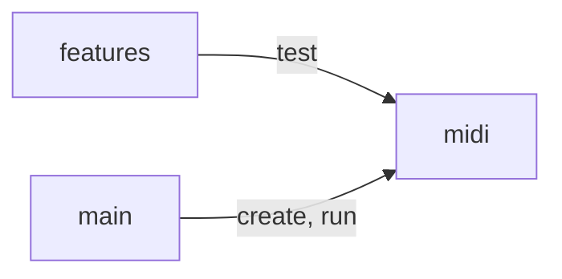

# Bam Bam

Converts a MIDI drum track from one drum sample map to another.

## Architecture decisions

- Establish development tools: CI/CD, formatting, linting, spell checks, test
  automation, and type checking.
  - Integrate with Git, so code is always formatted and checked for linting errors.
  - Write basic documentation for developers, to trace tools to their
    configuration and documentation.
- Use the following criteria to decide where to put code:
  - Goal: Use reasonable but fairly objective criteria to maintain flow.
    Example: using pure functions avoids the need to decide which class gets a
    new method and makes unit testing pretty simple.
  - Any data crossing a boundary: Make a `class`. Avoid naked primitives.
  - Simple data queries: Make these methods on the class containing the data.
  - Functions that do stuff: Make pure `functions`. Group pure functions that
    operate on the same type into a file named after that type (example:
    `midi-chunk-fns.ts`).

## Development

### Format code

```shell
npm run format #Re-format files in place
npm run format:check #CI-ready script that checks for improperly formatted files
```

### Install packages

```shell
npm install
npm ci #Make sure only the declared packages are installed (good for CI)
```

### Lint code

```shell
npm run lint #CI-ready script that checks for linting errors
npm run lint:fix #Automatically fix linting errors, where possible
```

### Run scripts

There's a utility script in `src/main/` that helps inspect MIDI files.

```shell
#List chunks
npm run main:list-chunks features/data/ezd-mapping.mid

#List events
npm run main:list-events features/support/midi-source/mapping/modern-original-mix-type-1.mid
npm run --silent main:list-events features/support/midi-source/mapping/modern-original-mix-type-1.mid | jq
npm run --silent main:list-events features/support/midi-source/mapping/modern-original-mix-type-1.mid \
  | jq '.tracks[1].events[] | { channel: .channel, deltaTime: .deltaTime, note: .note, type: .eventType, subType: .subType, velocity: .velocity }'
```

### Test code

```shell
npm run test #Run all Cucumber scenarios
npm run test:focus #Run scenarios tagged with @focus
npm run test -- [...cucumber.js args] #Pass custom options to cucumber.js
```

Cucumber scenarios can be tagged as follows, to change where data is sourced:

- `@FileMidiSource`: Read MIDI data from an actual file
- `@StaticMidiSource`: Build MIDI data inside the test

See `MidiSourceHooks.ts` for details.

### Type-check code

```shell
npm run types:check #CI-ready script that checks for type safety issues
npm run types:watch #Watch known source files, reporting any type issues live
```

## Development strategy

Start in the middle (domain model) and test outwards, via a different driver.
Push scenarios down to unit tests and extract libraries for stable parts.

Prefer over-simplification over using terminology from the solution domain.

## Future work

- Include Marker events?
  - It doesn't define timing or notes, but it does describe structure and form.
  - That might be useful when transferring a MIDI percussion track, to a
    MuseScore file, for the first time.
  - Updates to a MuseScore file that already have a percussion track won't
    benefit from that information.
- Include Key Signature?
  - It may not be very relevant on a percussion track.

## Source code structure

- `features/`: Feature and discovery tests, along with code specific to those.
- `main/`: Top-level scripts to call from `package.json`.
- `midi/`: Abstract data model and core logic.



## Tools

These tools are used for the project. Look here for references to documentation
and key configuration files.

### Code Spell Checker

_Identifies words that may be misspelled._

- Documentation: <https://github.com/streetsidesoftware/vscode-spell-checker>
- Files:
  - `cspell.json`: configuration file and dictionary
- VS Code extension:
  <https://marketplace.visualstudio.com/items?itemName=streetsidesoftware.code-spell-checker>

### Cucumber

_Runs BDD tests with Gherkin syntax._

- Files:
  - `features/cucumber.cjs`: configuration file for where to find tests and
    support code
  - `features/tsconfig.json`: TypeScript configuration
- Node packages:
  - `@cucumber/*` provides
    [cucumber](https://github.com/cucumber/cucumber-js/tree/main/docs) and
    formatters, which make the output on the command line look nice.
  - `ts-node` adds TypeScript support to `cucumber-js`.
  - `tsconfig-paths` allows TypeScript sources in `features/` to use path
    aliases to production code sources.
- VS Code Extension:
  <https://marketplace.visualstudio.com/items?itemName=CucumberOpen.cucumber-official>

### `direnv`

_Integrates environment management with your shell (e.g. `bash` or `zsh`)._

- Files:
  - `.envrc`: configuration script
- Installation:
  - Homebrew: `brew install direnv`
  - **Note: Follow instructions about updating `.bashrc` or `.zshrc`**

### EditorConfig

_Defines basic parameters for formatting source files._

- Files:
  - `.editorconfig`: configuration file

### ESLint

_Performs static analysis and style checks._

- Files:
  - `.eslintrc.cjs`: configuration file
- Node packages:
  - `eslint`: main package
  - `@typescript-eslint/eslint-plugin` and `@typescript-eslint/parser` add
    support for TypeScript.

### GitHub Actions

_Performs Continuous Integration / Continuous Deployment (CI/CD)._

- Files:
  - `.github/workflows`: Workflow definitions

### Husky

_Adds a Git pre-commit hook that runs checks on staged files, before committing
to the repository._

- Files:
  - `.husky/pre-commit`: The actual pre-commit script
  - `package.json` also has a `prepare` script that installs the Git hook.
- Node packages:
  - `husky`: main package

### `lint-staged`

_Runs the actual checks on source files staged for the next Git commit._

- Files:
  - `.lintstagedrc.cjs`: configuration file
- Node packages:
  - `lint-staged`: main package

### Markdownlint

_Checks Markdown files for style or formatting errors._

- Documentation:
  - Main: <https://github.com/DavidAnson/markdownlint>
  - Rules: <https://github.com/DavidAnson/markdownlint/blob/main/doc/Rules.md>
- Files:
  - `.markdownlint.json`: configuration file
- VS Code extension:
  <https://marketplace.visualstudio.com/items?itemName=DavidAnson.vscode-markdownlint>

### Node.js

_Node.js is the runtime platform._

- Files:
  - `package.json`: package properties, dependencies, and task automation (e.g.
    scripts)

### Node Version Manager (`nvm`)

_Installs a known version of Node.js and configures your shell to use it._

- Files
  - `.nvmrc`: configuration file

### Prettier

_Formats source files._

- Documentation:
  - Options: <https://prettier.io/docs/en/options.html>
- Files:
  - `.prettierignore`: which files should be skipped, while formatting
  - `.prettierrc.cjs`: configuration file
- Node packages:
  - `prettier`: main package

### TypeScript

_Adds static typing to JavaScript._

- Documentation:
  - Configuration (`tsconfig.json`): <https://www.typescriptlang.org/tsconfig>
- Files:
  - `tsconfig.json` - configuration file for sources in `src/`
  - `features/tsconfig.json` - configuration file for sources in `features/`
- Node packages:
  - `typescript`: main package
  - `@tsconfig/node18`: base configuration for the version of node.js we're
    using here
  - `@types/*`: type definitions for all the other packages we're using
  - [`tsconfig-paths`](https://www.npmjs.com/package/tsconfig-paths#with-ts-node):
    allows TypeScript sources to use path aliases at runtime, using `ts-node
-r`.

## Reference

### General MIDI Percussion key map

> For MIDI Channel 10, each MIDI KEY number ("NOTE#") corresponds to a
> different drum sound, as shown below. While many current instruments
> also have additional sounds above or below the range show here, and
> may even have additional "kits" with variations of these sounds, only
> these sounds are supported by General MIDI Level 1 devices.

```text
Key# Note Drum Sound        Key# Note Drum Sound
35 B0 Acoustic Bass Drum    59 B2 Ride Cymbal 2
36 C1 Bass Drum 1           60 C3 Hi Bongo
37 C#1 Side Stick           61 C#3 Low Bongo
38 D1 Acoustic Snare        62 D3 Mute Hi Conga
39 Eb1 Hand Clap            63 Eb3 Open Hi Conga
40 E1 Electric Snare        64 E3 Low Conga
41 F1 Low Floor Tom         65 F3 High Timbale
42 F#1 Closed Hi Hat        66 F#3 Low Timbale
43 G1 High Floor Tom        67 G3 High Agogo
44 Ab1 Pedal Hi-Hat         68 Ab3 Low Agogo
45 A1 Low Tom               69 A3 Cabasa
46 Bb1 Open Hi-Hat          70 Bb3 Maracas
47 B1 Low-Mid Tom           71 B3 Short Whistle
48 C2 Hi Mid Tom            72 C4 Long Whistle
49 C#2 Crash Cymbal 1       73 C#4 Short Guiro
50 D2 High Tom              74 D4 Long Guiro
51 Eb2 Ride Cymbal 1        75 Eb4 Claves
52 E2 Chinese Cymbal        76 E4 Hi Wood Block
53 F2 Ride Bell             77 F4 Low Wood Block
54 F#2 Tambourine           78 F#4 Mute Cuica
55 G2 Splash Cymbal         79 G4 Open Cuica
56 Ab2 Cowbell              80 Ab4 Mute Triangle
57 A2 Crash Cymbal 2        81 A4 Open Triangle
58 Bb2 Vibraslap
```

Source:
<https://musescore.org/sites/musescore.org/files/General%20MIDI%20Standard%20Percussion%20Set%20Key%20Map.pdf>

### MIDI format

- Document: `doc/midi/RP-001_v1-0_Standard_MIDI_Files_Specification_96-1-4.pdf`
- Source:
  <https://www.midi.org/component/edocman/rp-001-v1-0-standard-midi-files-specification-96-1-4-pdf/fdocument>

### Muse Score 4

Import a MIDI file into MuseScore 4 by drag and drop.

Note: There seems to be a bug in MuseScore 4, when re-importing a MIDI file that
has been updated. If MuseScore seems to be playing notes that you recently
updated, try closing MuseScore, opening it again, and importing the MIDI file
again.
