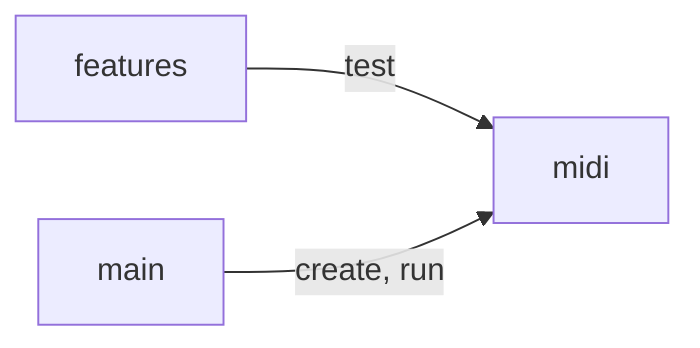

# Bam Bam

Converts a MIDI drum track from one drum sample map to another.

## Contents

### Source code

- `features/`: Feature and discovery tests, along with code specific to those.
- `main/`: Top-level scripts to call from `package.json`.
- `midi/`: Abstract data model and core logic.

## Documentation

- [Architecture](./doc/architecture.md)
- [MIDI Reference](./doc/midi.md)
- [Roadmap](./doc/roadmap.md)
- [Task Automation](./doc/task-automation.md)
- [Tools](./doc/tools.md)
