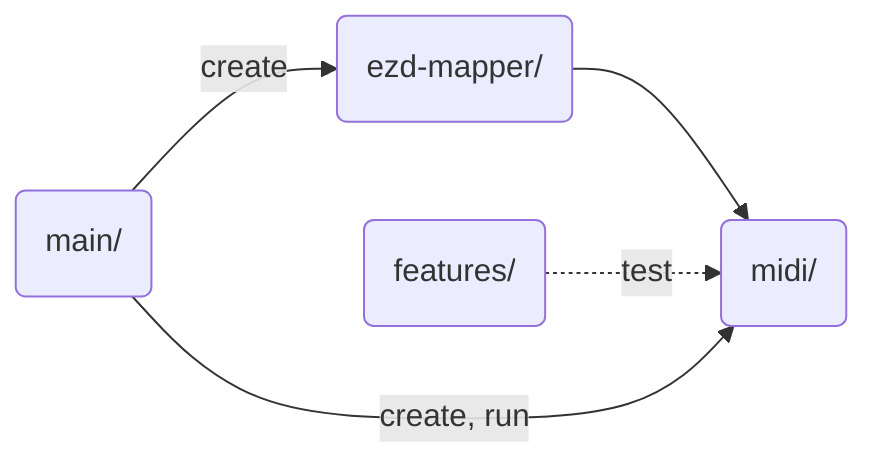

# Architecture Decisions

## 01: Use Tools

Establish development tools: CI/CD, formatting, linting, spell checks, test automation, and type
checking.

- Integrate with Git, so code is always formatted and checked for linting errors.
- Write basic documentation for developers, to trace tools to their configuration and documentation.

## 02: Code Structure

- **Goal**: Use reasonable but fairly objective criteria to maintain flow.
- **Example**: using pure functions avoids the need to decide which class gets a new method and
  makes unit testing pretty simple.

Use the following criteria to decide where to put code:

- Any data crossing a boundary: Make a `class`. Avoid naked primitives.
- Simple data queries: Make these methods on the class containing the data.
- Functions that do stuff: Make pure `functions`. Group pure functions that operate on the same
  type into a file named after that type (example: `midi-chunk-fns.ts`).

### Module Dependencies

